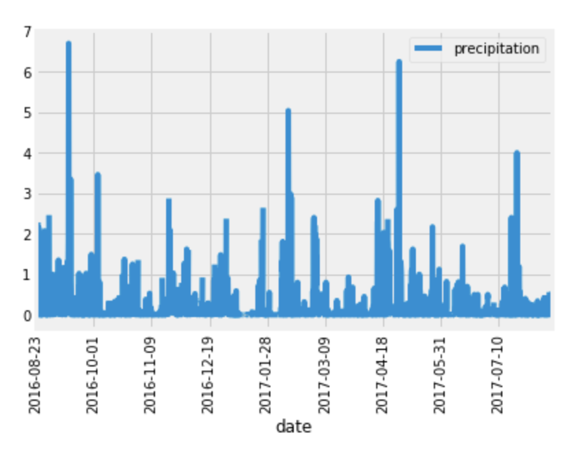

# Surfs Up
I've decided to travel to Hawaii and will need to do some climate analysis on the area for my trip planning.

## Files
Hawaii.sqlite

## Step 1: Climate Analysis and Exploration

- Use SQLAlchemy create_engine to connect to your sqlite database 
- Use SQLAlchemy automap_base() to reflect your tables into classes and save a reference to those classes called Station and Measurement

# Precipitation Analysis
- Design a query to retrieve the last 12 months of precipitation data
- Select only the date and prcp values
- Load the query results into a Pandas DataFrame and set the index to the date column
- Sort the DataFrame values by date
- Plot the results using the DataFrame plot method 

