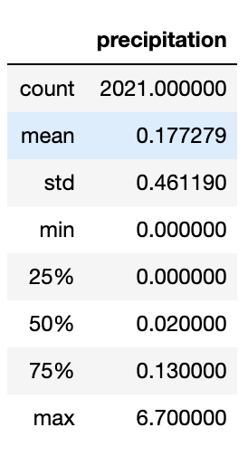
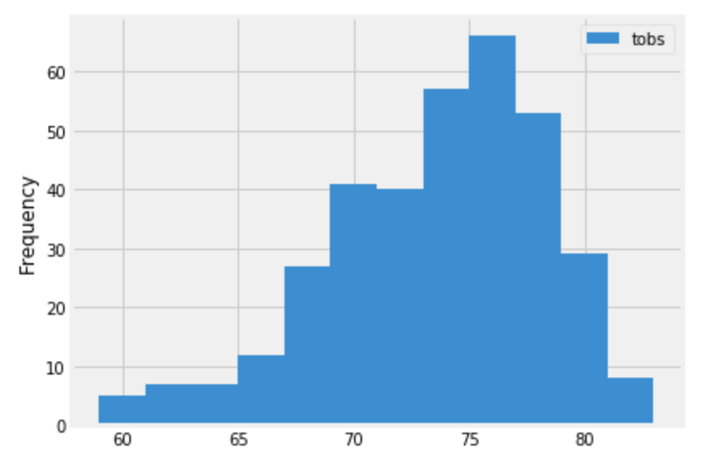
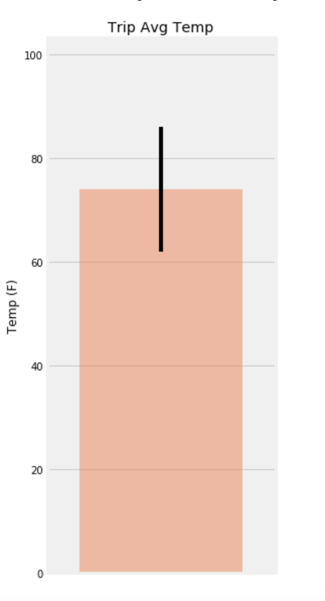
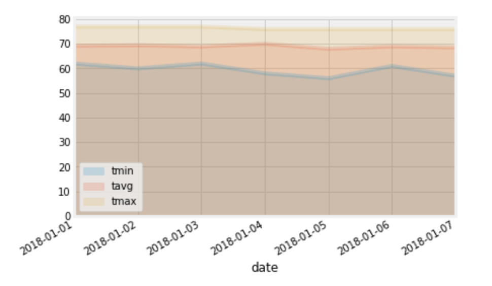

# Surfs Up
I've decided to travel to Hawaii and will need to do some climate analysis on the area for my trip planning.

## Files
Hawaii.sqlite

## Step 1: Climate Analysis and Exploration
- Use SQLAlchemy create_engine to connect to your sqlite database 
- Use SQLAlchemy automap_base() to reflect your tables into classes and save a reference to those classes called Station and Measurement

### Precipitation Analysis
- Design a query to retrieve the last 12 months of precipitation data
- Select only the date and prcp values
- Load the query results into a Pandas DataFrame and set the index to the date column
- Sort the DataFrame values by date
- Plot the results using the DataFrame plot method   

- Use Pandas to print the summary statistics for the precipitation data   
 

### Station Analysis
- Design a query to calculate the total number of stations
- Design a query to find the most active stations
- List the stations and observation counts in descending order
- Which station has the highest number of observations?
- Design a query to retrieve the last 12 months of temperature observation data (tobs)
- Filter by the station with the highest number of observations
- Plot the results as a histogram with bins=12

### Temperature Analysis 
- Use the `calc_temps` function to calculate the min, avg, and max temperatures for your trip using the matching dates from the previous year (i.e., use “2017-01-01” if your trip start date was “2018-01-01”)
- Plot the min, avg, and max temperature from your previous query as a bar chart
- Use the average temperature as the bar height
- Use the peak-to-peak (tmax-tmin) value as the y error bar (yerr)

<b> Daily Rainfall Average </b>
- Calculate the rainfall per weather station using the previous year’s matching dates
- Calculate the daily normals. Normals are the averages for the min, avg, and max temperatures
- Use `daily_normals` to calculate the daily normals for a specific date. This date string will be in the format `%m-%d`
- Create a list of dates for the trip in the format `%m-%d`. Use the `daily_normals` function to calculate the normals for each date string and append the results to a list
- Load the list of daily normals into a Pandas DataFrame and set the index equal to the date
- Use Pandas to plot an area plot (`stacked=False`) for the daily normals.

## Step 2: Climate App
Design a Flask API based on the queries that were developed above

`/`
- Home page
- List all routes that are available

`/api/v1.0/precipitation`
- Convert the query results to a Dictionary using date as the key and prcp as the value
- Return the JSON representation of your dictionary

`/api/v1.0/stations`
- Return a JSON list of stations from the dataset.

`/api/v1.0/tobs`
- Query for the dates and temperature observations from a year from the last data point.
- Return a JSON list of Temperature Observations (tobs) for the previous year.

`/api/v1.0/<start>` and `/api/v1.0/<start>/<end>`
- Return a JSON list of the minimum temperature, the average temperature, and the max temperature for a given start or start-end range
- When given the start only, calculate TMIN, TAVG, and TMAX for all dates greater than and equal to the start date
- When given the start and the end date, calculate the TMIN, TAVG, and TMAX for dates between the start and end date inclusive.

Use Flask `jsonify` to convert your API data into a valid JSON response object

## Tools
- Pandas
- Matplotlib
- SQLAlchemy (ORM Queries)
- Flask
